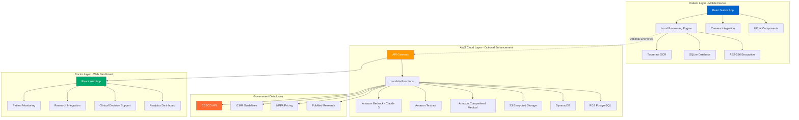

# MedTrust - AI-Powered Healthcare Intelligence Platform

<div align="center">


**Making Healthcare Accessible, Trusted, and Actionable for Every Indian**

[](https://opensource.org/licenses/MIT)
[](https://aws.amazon.com/)
[](https://reactnative.dev/)
[](https://www.typescriptlang.org/)
[](CONTRIBUTING.md)

[Features](#features) • [Architecture](#architecture) • [Getting Started](#getting-started) • [Documentation](#documentation) • [Contributing](#contributing)

</div>

---

## 🎯 Problem Statement

**70% of Indians struggle to understand their medical prescriptions.** Doctor's handwriting, medical jargon, and language barriers create confusion, leading to:
- 50% medication non-adherence
- Preventable medication errors
- ₹2000+ monthly unnecessary spending on branded medicines
- Poor health outcomes

**Doctors lack visibility** into patient adherence between visits and have limited access to latest research during prescribing.

**MedTrust solves this** by creating a collaborative AI-powered ecosystem between patients, doctors, and government medical bodies.

---

## ✨ Features

### For Patients (1.4B Indians)

- 📸 **Smart Prescription Scanner** - OCR for printed & handwritten prescriptions (85-90% accuracy)
- 🌐 **22 Indian Languages** - Full translation with voice output
- 💊 **Simple Explanations** - Medical jargon → 8th grade language
- ⏰ **Medication Reminders** - Visual schedules with adherence tracking
- 💰 **Cost Savings** - Generic alternatives (save 60-70%)
- ✅ **Government Verification** - CDSCO, ICMR, NPPA data integration
- 📊 **Health Tracking** - BP, blood sugar, weight with trend analysis
- 📴 **Offline Mode** - Works without internet (rural India)
- 🔒 **Privacy-First** - Local processing by default, encrypted storage

### For Doctors (1.3M)

- 📈 **Patient Monitoring** - Real-time adherence & health parameters
- 🔬 **Research Integration** - PubMed + AI summaries
- 🩺 **Clinical Decision Support** - Drug interactions, dosage validation, guideline compliance
- 📊 **Cohort Analytics** - Aggregate outcomes, benchmark comparison
- 🧪 **Real-World Evidence** - Contribute to medical research

### For Government/Public Health

- ✅ **Prescription Validation** - Automatic CDSCO approval checking
- 📋 **Guideline Compliance** - ICMR protocol tracking
- 🚨 **Safety Alerts** - Rapid distribution to affected patients
- 📊 **Public Health Insights** - Anonymized population health data

---

## 🏗️ Architecture

### High-Level Overview



**Key Principles:**
- 🔒 **Privacy-First**: Local processing by default
- 📴 **Offline-Capable**: Core features work without internet
- 🔐 **Secure**: End-to-end encryption, HIPAA compliant
- 📈 **Scalable**: Serverless architecture, handles 1M+ users
- 🌍 **Accessible**: 22 languages, voice output, works on low-end devices

📐 **[View Detailed Architecture Diagrams](docs/ARCHITECTURE_DIAGRAM.md)** - Complete system, data flow, security, deployment, and scalability diagrams

---

## 🚀 Getting Started

### Prerequisites

- Node.js 20.x or higher
- React Native development environment ([Setup Guide](https://reactnative.dev/docs/environment-setup))
- AWS Account (for cloud features)
- iOS/Android device or emulator

### Installation

```bash
# Clone the repository
git clone https://github.com/mjpvl-ai/MedTrust.git
cd MedTrust

# Install dependencies
npm install

# Install iOS dependencies (macOS only)
cd ios && pod install && cd ..

# Set up environment variables
cp .env.example .env
# Edit .env with your AWS credentials

# Start Metro bundler
npm start

# Run on iOS
npm run ios

# Run on Android
npm run android
```

### Quick Start (Local Mode Only)

```bash
# Run without AWS services (offline mode)
npm run start:local

# This will use local OCR and database only
```

---

## 📚 Documentation

- [📐 Architecture Diagrams](docs/ARCHITECTURE_DIAGRAM.md) - **Complete visual architecture**
- [📖 Requirements Specification](docs/requirements.md)
- [🏗️ Architecture & Design](docs/design.md)
- [✅ Implementation Tasks](docs/tasks.md)
- [📊 Project Structure](docs/PROJECT_STRUCTURE.md)

---

## 🛠️ Tech Stack

### Mobile App
- **React Native** - Cross-platform mobile development
- **TypeScript** - Type safety
- **Redux** - State management
- **SQLite** - Local database
- **Tesseract.js** - Local OCR

### Backend
- **AWS Lambda** - Serverless compute
- **Amazon Bedrock** - AI explanations (Claude 3)
- **Amazon Textract** - Advanced OCR
- **Amazon Comprehend Medical** - Medical entity extraction
- **Node.js + TypeScript** - Runtime

### Data Storage
- **SQLite** - Local mobile storage
- **Amazon S3** - Encrypted object storage
- **Amazon DynamoDB** - NoSQL database
- **Amazon RDS (PostgreSQL)** - Relational analytics

### Security
- **AWS KMS** - Key management
- **AES-256** - Encryption at rest
- **TLS 1.3** - Encryption in transit

---

## 🧪 Testing

```bash
# Run unit tests
npm test

# Run property-based tests
npm run test:property

# Run integration tests
npm run test:integration

# Run E2E tests
npm run test:e2e

# Generate coverage report
npm run test:coverage
```

**Testing Strategy:**
- ✅ Unit Tests: 80%+ coverage
- ✅ Property-Based Tests: 58 correctness properties
- ✅ Integration Tests: All user flows
- ✅ E2E Tests: Critical paths

---

## 🤝 Contributing

We welcome contributions! Please see our [Contributing Guide](CONTRIBUTING.md) for details.

### Development Workflow

1. Fork the repository
2. Create a feature branch (`git checkout -b feature/amazing-feature`)
3. Commit your changes (`git commit -m 'Add amazing feature'`)
4. Push to the branch (`git push origin feature/amazing-feature`)
5. Open a Pull Request

### Code of Conduct

Please read our [Code of Conduct](CODE_OF_CONDUCT.md) before contributing.

---

## 📊 Impact

- 🌍 **Target Audience**: 1.4 billion Indians
- 📈 **Medication Adherence**: 50% → 80% (60% improvement)
- 💰 **Cost Savings**: ₹2,000/month average per patient
- 🏥 **Medication Errors**: 50% reduction
- 🌐 **Languages**: 22 Indian languages supported
- 📴 **Offline**: Works in rural areas without internet

---

## 🏆 Awards & Recognition

- 🥇 AWS AI for Bharat Hackathon 2026 - [Participant]
- 📰 Featured in [Publication Name]
- 🎤 Presented at [Conference Name]

---

## 📄 License

This project is licensed under the MIT License - see the [LICENSE](LICENSE) file for details.

---

## 👥 Team

**HAI - Health AI**

- **Jayaprakash Murugan** - Founder & Solo Developer - [GitHub](https://github.com/mjpvl-ai)

---

## 📞 Contact

- **Developer**: Jayaprakash Murugan
- **GitHub**: [github.com/mjpvl-ai](https://github.com/mjpvl-ai)
- **Project**: [github.com/mjpvl-ai/MedTrust](https://github.com/mjpvl-ai/MedTrust)

---

## 🙏 Acknowledgments

- AWS for providing cloud infrastructure and AI services
- CDSCO, ICMR, NPPA for official healthcare data
- Open-source community for amazing tools and libraries
- Healthcare professionals who provided feedback

---

## 🗺️ Roadmap

### Phase 1: MVP (Completed)
- ✅ Prescription scanning (local OCR)
- ✅ Medicine database
- ✅ Simple explanations
- ✅ Multilingual support (5 languages)

### Phase 2: Cloud Enhancement (In Progress)
- 🔄 AWS Bedrock integration
- 🔄 Amazon Textract
- 🔄 Government data sync
- 🔄 Doctor dashboard

### Phase 3: Scale (Q2 2026)
- 📅 Expand to 22 languages
- 📅 1M user milestone
- 📅 Hospital partnerships
- 📅 Real-world evidence studies

### Phase 4: Expansion (Q3-Q4 2026)
- 📅 International expansion
- 📅 API platform for developers
- 📅 Integration with EHR systems
- 📅 Advanced analytics

---

<div align="center">

**Made with ❤️ by HAI - Health AI**

**Transforming Healthcare for 1.4 Billion Indians**

[⭐ Star us on GitHub](https://github.com/mjpvl-ai/MedTrust) | [🐛 Report Bug](https://github.com/mjpvl-ai/MedTrust/issues) | [💡 Request Feature](https://github.com/mjpvl-ai/MedTrust/issues)

</div>
