# MedTrust - AWS Architecture Diagrams

This document provides comprehensive visual architecture diagrams for the MedTrust Healthcare Intelligence Platform, showcasing the complete AWS infrastructure, data flows, security architecture, and deployment strategy.

## Table of Contents

1. [High-Level System Architecture](#1-high-level-system-architecture)
2. [AWS Cloud Infrastructure](#2-aws-cloud-infrastructure)
3. [Data Flow Architecture](#3-data-flow-architecture)
4. [Security Architecture](#4-security-architecture)
5. [Deployment Architecture](#5-deployment-architecture)
6. [Scalability Architecture](#6-scalability-architecture)

---

## 1. High-Level System Architecture

### Overview
The MedTrust platform follows a local-first, privacy-preserving architecture with optional cloud enhancement. The system creates a trusted collaborative ecosystem between patients, doctors, and government medical bodies.

### Architecture Diagram

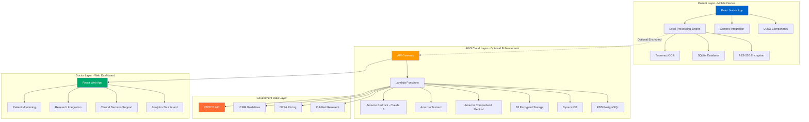

### Key Components

| Layer | Components | Purpose |
|-------|-----------|---------|
| **Patient Layer** | React Native App, Local OCR, SQLite | Core patient-facing features, offline-capable |
| **Cloud Layer** | AWS Services (Bedrock, Textract, Lambda) | Advanced AI processing, enhanced OCR |
| **Government Layer** | CDSCO, ICMR, NPPA, PubMed APIs | Official data sources for validation |
| **Doctor Layer** | Web Dashboard, Analytics | Doctor monitoring and decision support |

---

## 2. AWS Cloud Infrastructure

### Detailed AWS Services Architecture

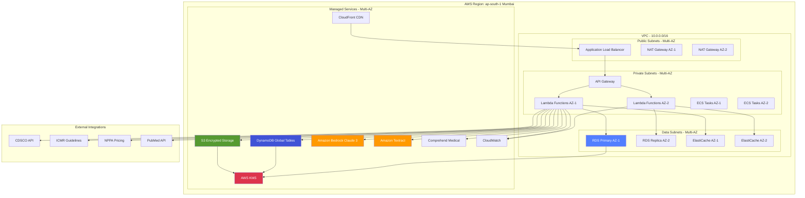

### AWS Services Breakdown

#### Compute Services
- **AWS Lambda**: Serverless compute for all backend processing
  - OCR processing functions
  - AI explanation generation
  - Data validation and transformation
  - Analytics aggregation
  - Auto-scaling based on demand

- **Amazon ECS (Optional)**: For long-running tasks
  - Batch data processing
  - Research paper analysis
  - Large-scale analytics

#### AI/ML Services
- **Amazon Bedrock (Claude 3)**: Advanced AI explanations
  - Medical jargon simplification
  - Personalized health guidance
  - Research paper summarization
  - Clinical decision support

- **Amazon Textract**: Advanced OCR
  - Handwritten prescription recognition
  - Form field extraction
  - Table detection in lab reports

- **Amazon Comprehend Medical**: Medical entity extraction
  - Drug name recognition
  - Dosage extraction
  - Medical condition identification

#### Storage Services
- **Amazon S3**: Encrypted object storage
  - Prescription images (encrypted)
  - Health reports
  - Research papers
  - Backup data
  - Lifecycle policies for data retention

- **Amazon DynamoDB**: NoSQL database
  - User sessions
  - Real-time adherence tracking
  - Notification queues
  - Global tables for multi-region

- **Amazon RDS (PostgreSQL)**: Relational database
  - Medicine database
  - Treatment guidelines
  - Patient-doctor relationships
  - Analytics data warehouse
  - Multi-AZ deployment

- **Amazon ElastiCache (Redis)**: Caching layer
  - API response caching
  - Session management
  - Rate limiting
  - Real-time analytics

#### Security Services
- **AWS KMS**: Key management
  - Data encryption keys
  - Key rotation policies
  - Audit logging

- **AWS IAM**: Identity and access management
  - Role-based access control
  - Service-to-service authentication
  - Temporary credentials

- **AWS WAF**: Web application firewall
  - DDoS protection
  - SQL injection prevention
  - Rate limiting

#### Networking Services
- **Amazon VPC**: Virtual private cloud
  - Network isolation
  - Security groups
  - Network ACLs
  - VPC endpoints for AWS services

- **Amazon CloudFront**: CDN
  - Global content delivery
  - SSL/TLS termination
  - DDoS protection

- **Amazon Route 53**: DNS service
  - Domain management
  - Health checks
  - Failover routing

#### Monitoring & Logging
- **Amazon CloudWatch**: Monitoring and logging
  - Application logs
  - Performance metrics
  - Custom dashboards
  - Alarms and notifications

- **AWS X-Ray**: Distributed tracing
  - Request tracing
  - Performance bottleneck identification
  - Service map visualization

---

## 3. Data Flow Architecture

### Prescription Processing Flow

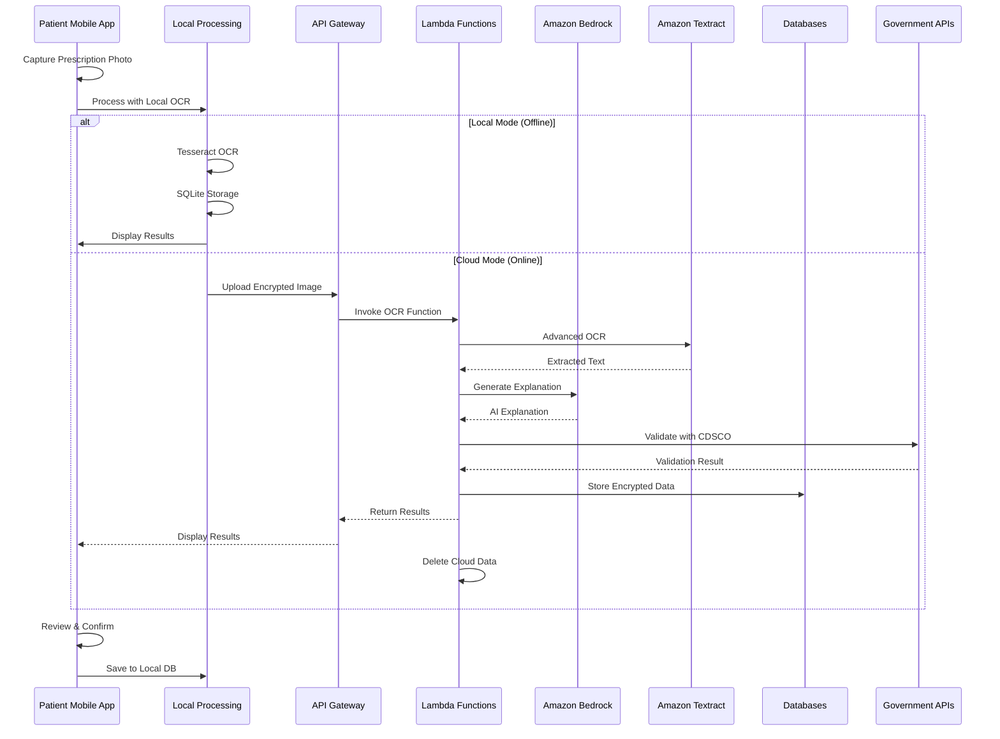

### Doctor Dashboard Data Flow

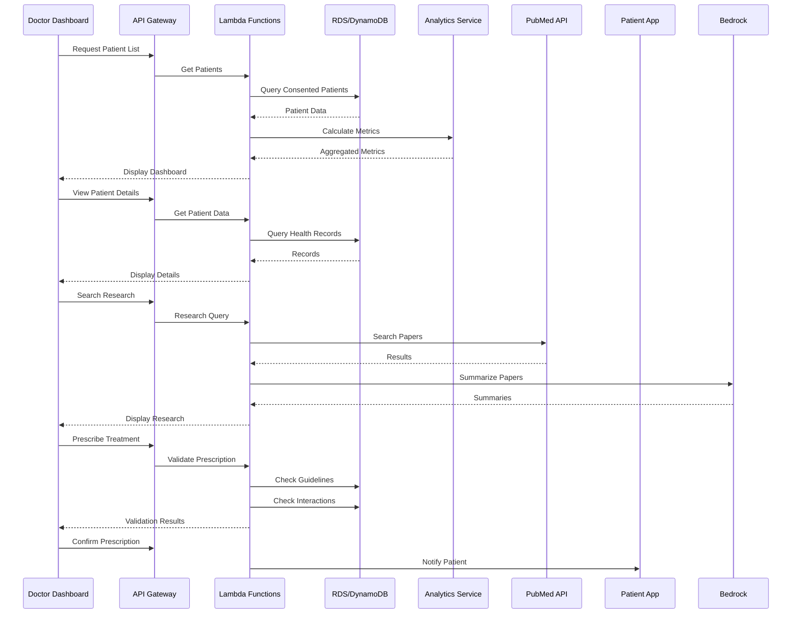

### Real-Time Adherence Tracking Flow

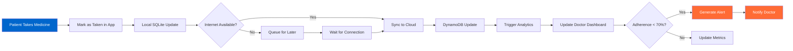

---

## 4. Security Architecture

### Multi-Layer Security Model

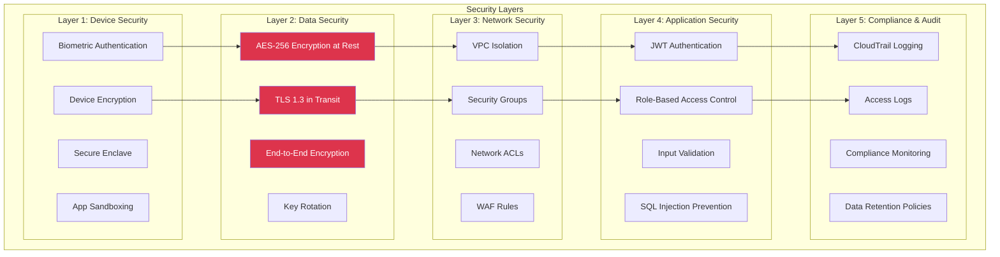

### Data Encryption Flow

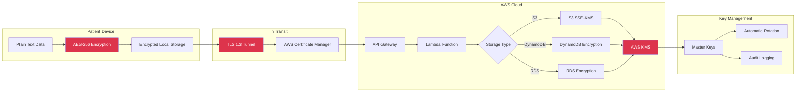

### Access Control Model

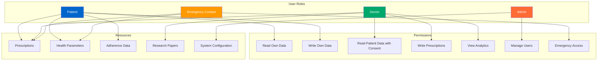

---

## 5. Deployment Architecture

### Multi-Region Deployment Strategy

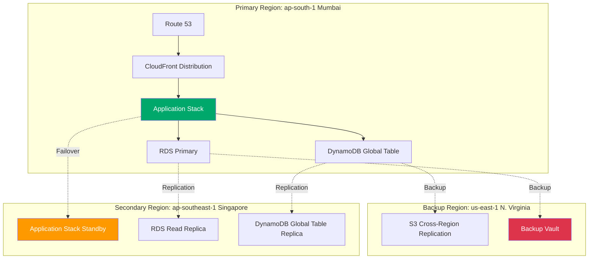

### CI/CD Pipeline

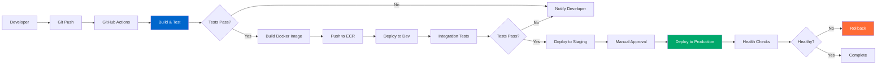

### Infrastructure as Code

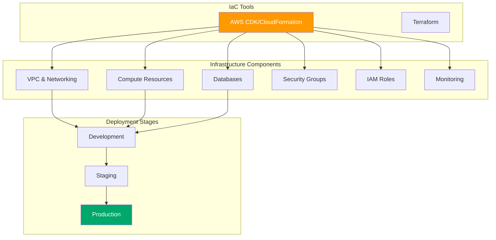

---

## 6. Scalability Architecture

### Auto-Scaling Strategy

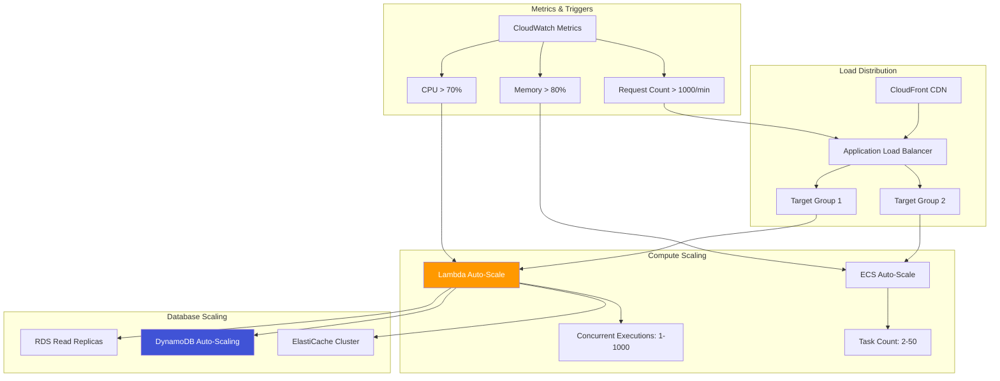

### Performance Optimization

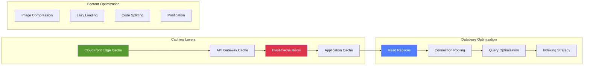

### Cost Optimization Strategy

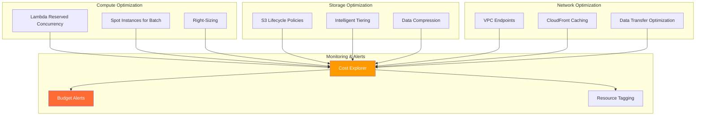

---

## Architecture Highlights

### Key Design Decisions

1. **Local-First Architecture**
   - Core features work offline
   - Privacy by default
   - Reduced cloud costs
   - Better user experience in low-connectivity areas

2. **Serverless-First Approach**
   - AWS Lambda for compute
   - Pay-per-use pricing
   - Automatic scaling
   - Reduced operational overhead

3. **Multi-Layer Security**
   - Encryption at rest and in transit
   - Zero-trust architecture
   - Compliance with healthcare regulations
   - Audit logging for all access

4. **High Availability**
   - Multi-AZ deployment
   - Cross-region replication
   - Automatic failover
   - 99.99% uptime SLA

5. **Cost Optimization**
   - Serverless architecture
   - Caching strategies
   - S3 lifecycle policies
   - Reserved capacity for predictable workloads

### Scalability Targets

| Metric | Target | Strategy |
|--------|--------|----------|
| **Concurrent Users** | 100,000+ | Lambda auto-scaling, CloudFront CDN |
| **API Requests** | 10,000/sec | API Gateway throttling, caching |
| **Data Storage** | 100+ TB | S3 with lifecycle policies |
| **Database Queries** | 50,000/sec | Read replicas, ElastiCache |
| **OCR Processing** | 1,000/min | Lambda concurrent executions |
| **AI Explanations** | 500/min | Bedrock quota management |

### Compliance & Certifications

- **HIPAA Compliant**: Healthcare data protection
- **ISO 27001**: Information security management
- **SOC 2 Type II**: Security, availability, confidentiality
- **GDPR Ready**: Data privacy and protection
- **Indian Data Protection**: Compliance with local regulations

---

## Cost Estimation

### Monthly AWS Costs (Estimated for 100,000 Active Users)

| Service | Usage | Monthly Cost (USD) |
|---------|-------|-------------------|
| **Lambda** | 50M requests, 512MB, 3s avg | $250 |
| **API Gateway** | 50M requests | $175 |
| **Amazon Bedrock** | 10M tokens | $300 |
| **Amazon Textract** | 1M pages | $1,500 |
| **S3** | 10TB storage, 50TB transfer | $350 |
| **DynamoDB** | 100GB, 10M reads, 5M writes | $200 |
| **RDS PostgreSQL** | db.r5.xlarge Multi-AZ | $600 |
| **ElastiCache** | cache.r5.large | $200 |
| **CloudFront** | 100TB transfer | $850 |
| **KMS** | 10,000 requests/month | $10 |
| **CloudWatch** | Logs, metrics, alarms | $150 |
| **Data Transfer** | Inter-region, internet | $500 |
| **Total** | | **~$5,085/month** |

**Cost per User**: ~$0.05/month

### Cost Optimization Opportunities

1. **Reserved Capacity**: 30-40% savings on RDS and ElastiCache
2. **Savings Plans**: 20-30% savings on Lambda and compute
3. **S3 Intelligent Tiering**: 30-50% savings on storage
4. **Spot Instances**: 70-90% savings on batch processing
5. **Caching**: Reduce API calls and compute costs

---

## Monitoring & Observability

### Key Metrics Dashboard

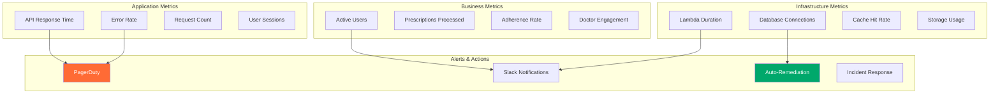

---

## Disaster Recovery

### Backup Strategy

- **RDS**: Automated daily backups, 7-day retention, point-in-time recovery
- **DynamoDB**: Point-in-time recovery enabled, 35-day retention
- **S3**: Versioning enabled, cross-region replication
- **Lambda**: Code stored in version control, automated deployments

### Recovery Time Objectives

| Component | RTO | RPO | Strategy |
|-----------|-----|-----|----------|
| **Application** | 15 minutes | 5 minutes | Multi-AZ, auto-failover |
| **Database** | 30 minutes | 5 minutes | Multi-AZ, read replicas |
| **Storage** | 1 hour | 1 hour | Cross-region replication |
| **Complete System** | 2 hours | 15 minutes | Multi-region deployment |

---

## Conclusion

The MedTrust AWS architecture is designed for:

✅ **Privacy**: Local-first with optional cloud enhancement  
✅ **Security**: Multi-layer encryption and access control  
✅ **Scalability**: Serverless architecture handling millions of users  
✅ **Reliability**: Multi-AZ deployment with 99.99% uptime  
✅ **Cost-Efficiency**: Pay-per-use model with optimization strategies  
✅ **Compliance**: HIPAA, ISO 27001, SOC 2, GDPR ready  

This architecture supports MedTrust's mission to make healthcare accessible, trusted, and actionable for 1.4 billion Indians.

---

**Document Version**: 1.0  
**Last Updated**: February 5, 2026  
**Maintained By**: HAI - Health AI Team
